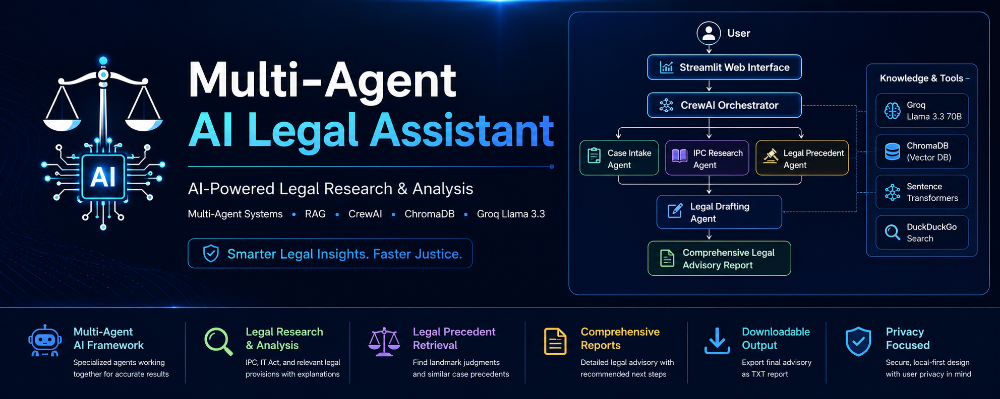
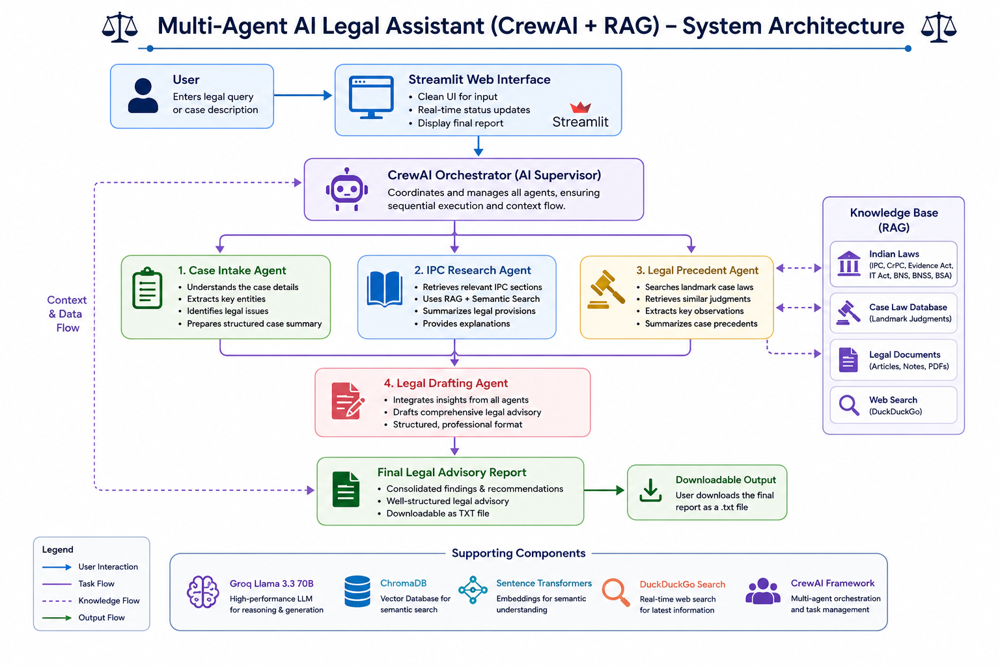
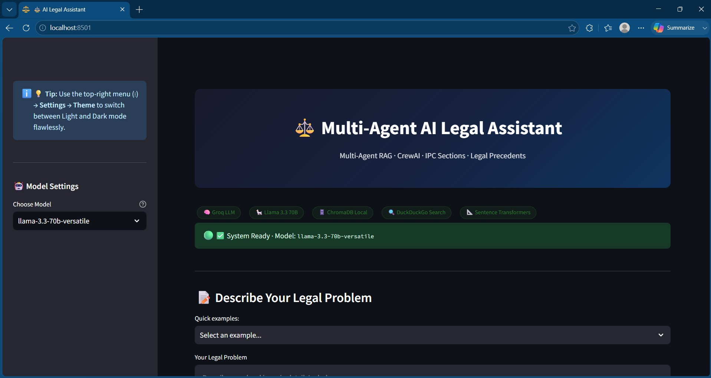
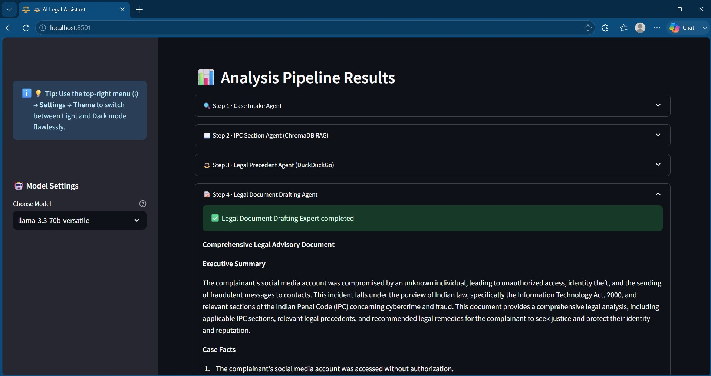
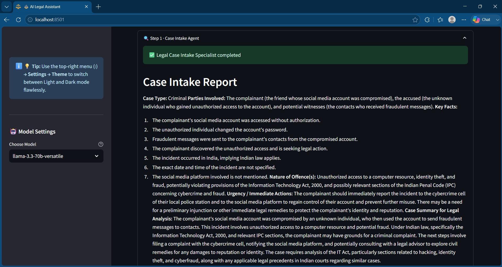
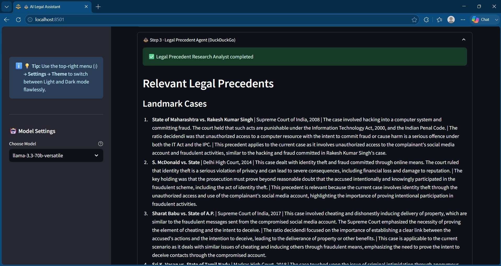
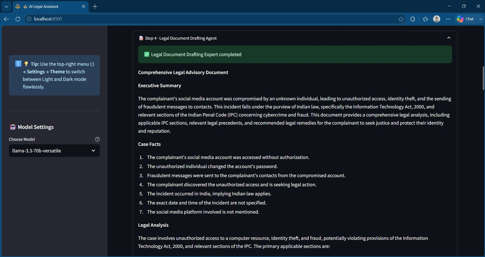
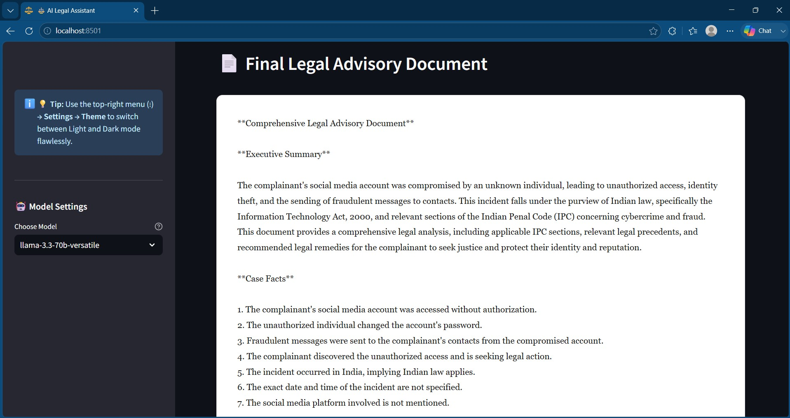

# ⚖️ Multi-Agent AI Legal Assistant (CrewAI + RAG)

<p align="center">
  
</p>

<p align="center">


</p>

<p align="center">
AI-powered Legal Decision Support System built using <b>CrewAI</b>, <b>Retrieval-Augmented Generation (RAG)</b>, <b>Groq Llama 3.3</b>, <b>ChromaDB</b>, and <b>Streamlit</b>.
</p>

---

# 📖 Overview

The **Multi-Agent AI Legal Assistant** is an AI-powered legal decision support system that analyzes legal cases using a **CrewAI-based multi-agent architecture**.

Instead of relying on a single LLM, the application divides legal reasoning into specialized AI agents responsible for:

- 🧾 Case Intake & Fact Extraction
- 📚 Legal Provision Research
- ⚖️ Legal Precedent Retrieval
- 📝 Final Legal Advisory Generation

The project combines **Retrieval-Augmented Generation (RAG)** with **CrewAI**, **ChromaDB**, **Sentence Transformers**, **DuckDuckGo Search**, and **Groq Llama 3.3** to generate structured legal analyses.

> **Disclaimer:** This project is intended for educational and research purposes only and should not be considered professional legal advice.

---

# 🏗 System Architecture

# 🏗️ System Architecture

<p align="center">
  
</p>

The Multi-Agent AI Legal Assistant follows a modular CrewAI-based architecture. The Streamlit interface accepts user queries, which are orchestrated through specialized AI agents. Each agent performs a dedicated legal reasoning task, leveraging Retrieval-Augmented Generation (RAG), semantic search, and external legal resources before generating a comprehensive legal advisory report.

---

# ✨ Features

- 🤖 Multi-Agent AI Workflow
- 📋 Case Intake & Fact Extraction
- 📚 IPC / IT Act Research
- ⚖️ Legal Precedent Retrieval
- 🧠 Retrieval-Augmented Generation (RAG)
- 🗂 ChromaDB Vector Search
- 🚀 Groq Llama 3.3 Integration
- 🌐 DuckDuckGo Search
- 📄 Downloadable Legal Report (.txt)
- 🖥 Interactive Streamlit Interface

---

# 🤖 Multi-Agent Workflow

1. **Case Intake Agent** – Understands the legal issue and extracts structured facts.

2. **IPC Legal Research Agent** – Retrieves relevant legal provisions.

3. **Legal Precedent Agent** – Searches for similar legal precedents.

4. **Legal Document Drafting Agent** – Generates the final legal advisory report.

---

# 🛠 Technology Stack

| Technology | Purpose |
|------------|---------|
| Python | Backend |
| CrewAI | Multi-Agent Orchestration |
| Streamlit | User Interface |
| Groq | LLM |
| Llama 3.3 | Reasoning Model |
| ChromaDB | Vector Database |
| Sentence Transformers | Embeddings |
| DuckDuckGo | Legal Search |
| RAG | Context Retrieval |

---

# 📂 Project Structure

```text
Multi-Agent-AI-Legal-Assistant/
│
├── data/
├── tools/
├── screenshots/
├── sample_outputs/
├── app.py
├── agents.py
├── crew.py
├── tasks.py
├── requirements.txt
├── .env.example
└── README.md
```

---

# ⚙ Installation

```bash
git clone https://github.com/shreyas-karanjkar/Multi-Agent-AI-Legal-Assistant.git

cd Multi-Agent-AI-Legal-Assistant

py -3.11 -m venv venv

venv\Scripts\activate

python -m pip install -r requirements.txt
```

Create `.env`

```env
GROQ_API_KEY=your_groq_api_key_here
GROQ_MODEL=llama-3.3-70b-versatile
```

Run

```bash
streamlit run app.py
```

---

# 💡 Sample Legal Query

```text
A friend of mine discovered that someone had gained unauthorized access to their social media account, changed the password, and used the account to send fraudulent messages to their contacts.

What legal action can my friend take under Indian law? Please identify the applicable provisions, legal precedents, and recommended next steps.
```

---

# 📸 Application Demo

Rename your screenshots exactly as:

```text
screenshots/
├── home-page.jpg
├── legal-query.jpg
├── analysis-pipeline.jpg
├── case-intake-agent.jpg
├── ipc-research-agent.jpg
├── legal-precedent-agent.jpg
├── legal-drafting-agent.jpg
└── final-report.jpg
```

## Home Page



## User Query


## Analysis Pipeline



## Case Intake Agent



## IPC Research Agent


## Legal Precedent Agent



## Legal Drafting Agent



## Final Legal Advisory Report



---

# 📄 Sample Output

Rename your downloaded report as:

```text
sample_outputs/
└── cybercrime-case-analysis.txt
```

Open directly from GitHub:

**📄 [Sample Legal Advisory Report](sample_outputs/cybercrime-case-analysis.txt)**

---

# 🚀 Future Improvements

- Support for Bharatiya Nyaya Sanhita (BNS)
- PDF Upload
- Voice-based Legal Queries
- Confidence Scores
- Source Citations
- Cloud Deployment
- Multilingual Support

---

# ⚠ Disclaimer

This application is intended for educational and research purposes only.

The generated legal analyses are AI-generated and should not be considered professional legal advice.

---

# 👨‍💻 Author

**Shreyas Karanjkar**

M.Tech (Computer Science & Engineering)

VIT Vellore

---

⭐ If you found this project useful, consider giving it a star.
